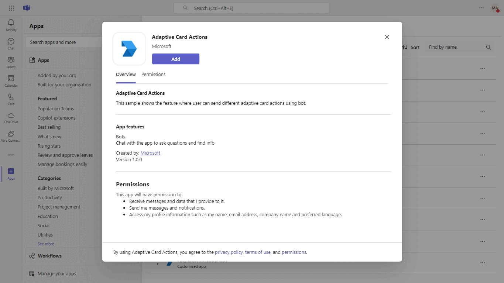
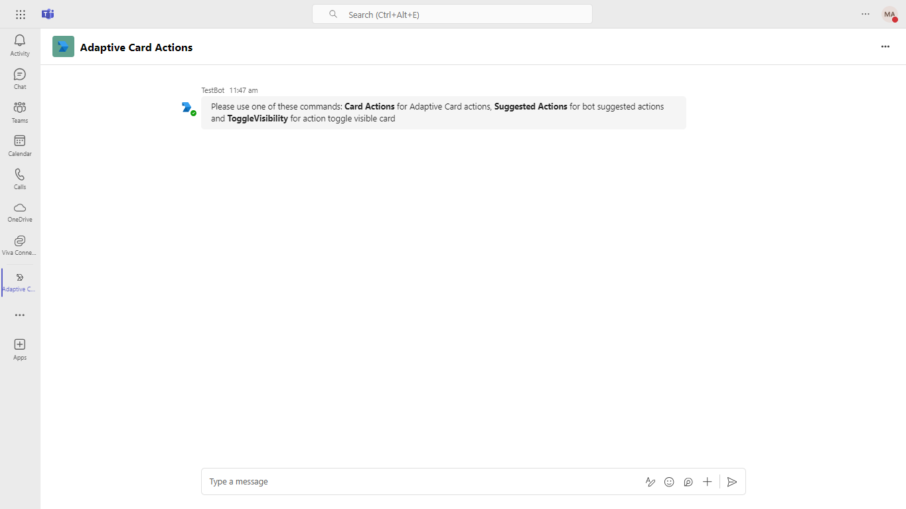
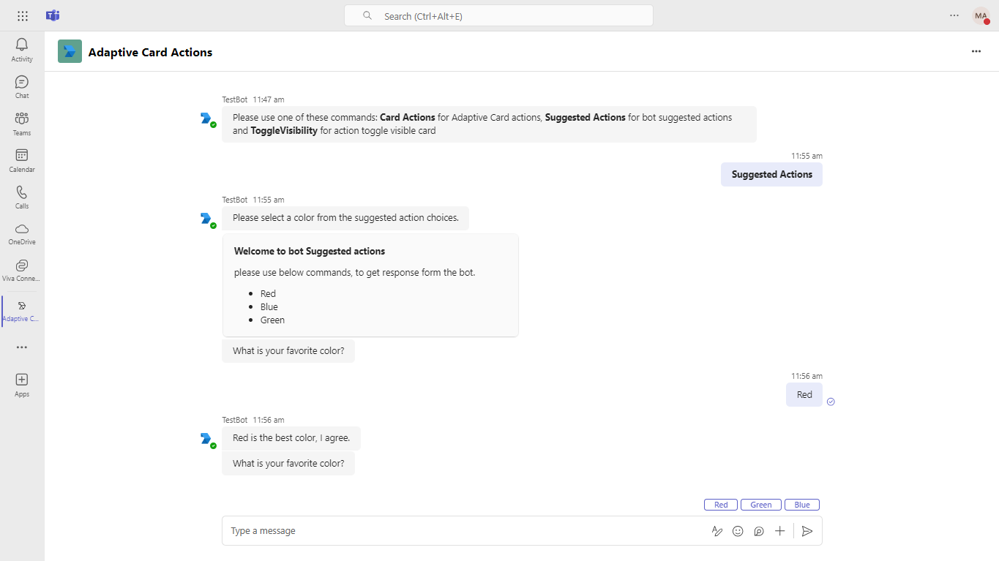
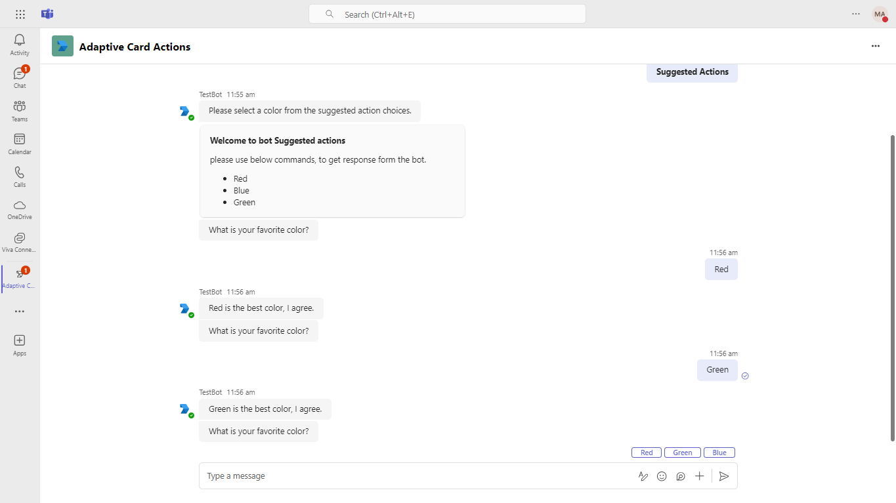
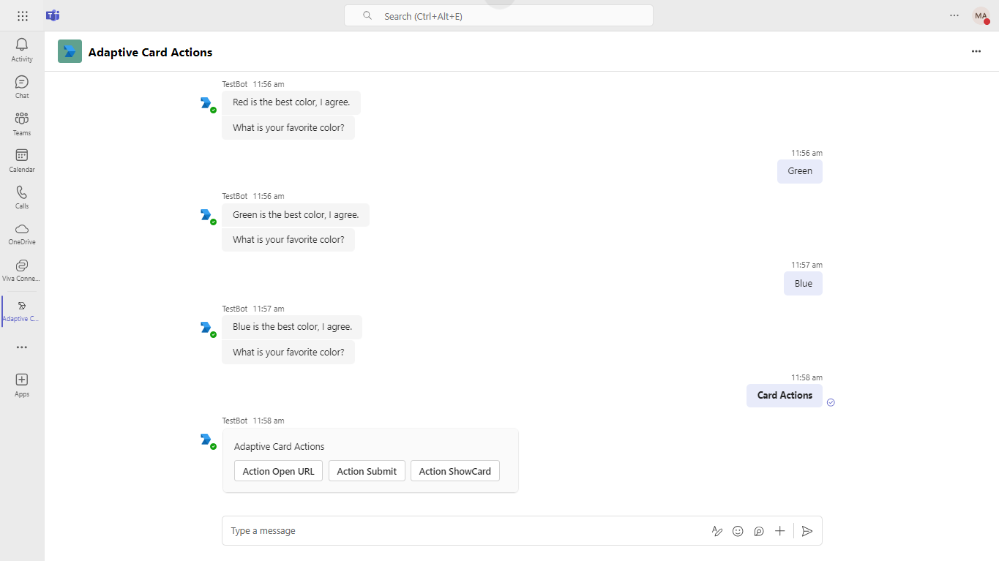
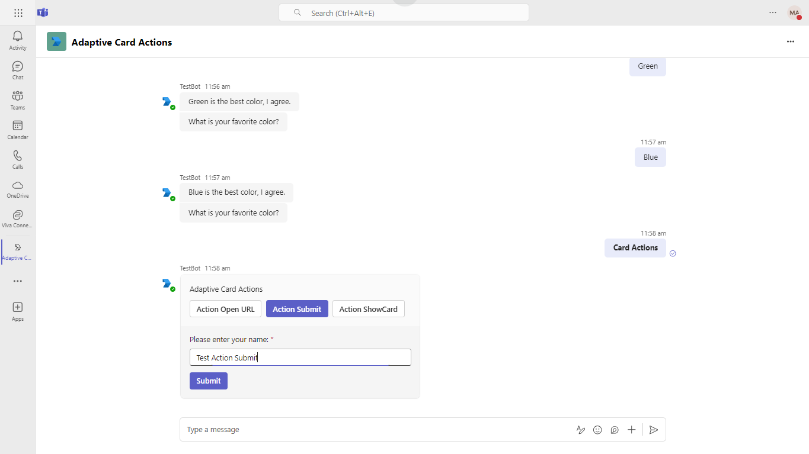
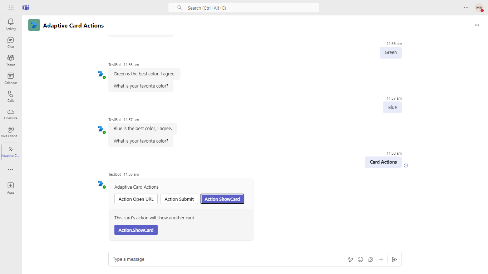
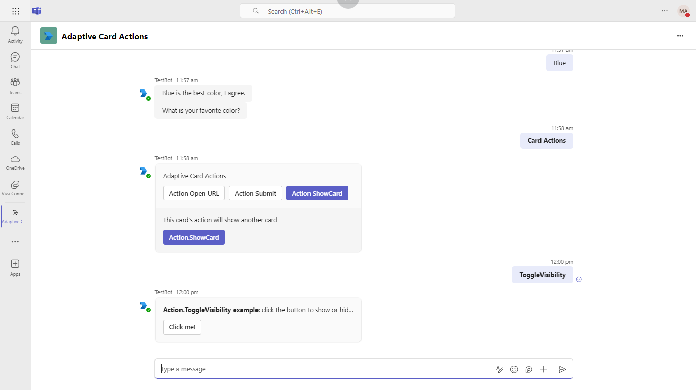
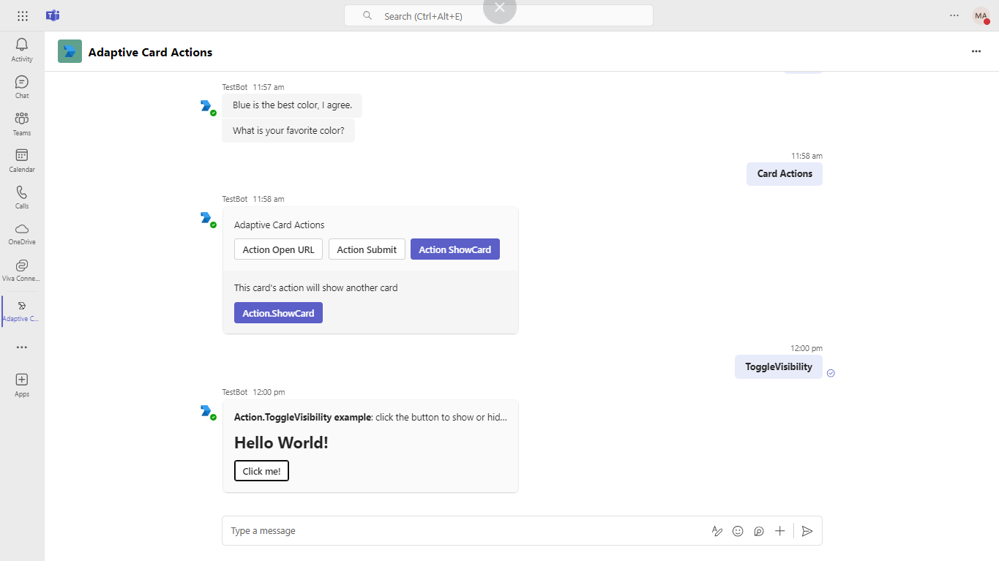

# Send Adaptive Card with multiple actions

This sample shows how to send an Adaptive Card actions using [Agents SDK](https://github.com/microsoft/agents).
Explore a sample Agent that showcases multiple Adaptive Card action types in Microsoft Teams, enabling dynamic user interactions. This 
implementation includes features for sending adaptive cards and utilizing agent capabilities to enhance user engagement.

## Included Features
* Agents
* Teams
* Adaptive Cards

## Interaction with app



## Prerequisites

- Microsoft Teams is installed and you have an account
- [.NET SDK](https://dotnet.microsoft.com/download) version 8.0
- [dev tunnel](https://learn.microsoft.com/en-us/azure/developer/dev-tunnels/get-started?tabs=windows)
- [Teams](https://teams.microsoft.com) Microsoft Teams is installed and you have an account

## Setup
   
1. Run Dev Tunnels
To enable to calls into the Agent running on your local development environment, you'll need to setup Azure DevTunnels. Please follow [Create and host a dev tunnel](https://learn.microsoft.com/en-us/azure/developer/dev-tunnels/get-started?tabs=windows) and host the tunnel with anonymous user access command as shown below:
    
> NOTE: Go to your project directory and open the `./Properties/launchSettings.json` file. Check the port number and update it to match your DevTunnel port. If `./Properties/launchSettings.json` is not found close and re-open the solution.

   ```bash
   devtunnel host -p 3978 --allow-anonymous
   ```

1. Setup
	- Register a Microsoft Entra ID app registration in Azure portal [Microsoft Entra ID – App Registrations](https://go.microsoft.com/fwlink/?linkid=2083908). Select single tenant access. No redirect URI is needed.     
	- Register with the Azure Bot Service, following the instructions [here](https://docs.microsoft.com/azure/bot-service/bot-service-quickstart-registration?view=azure-bot-service-3.0).
	- Ensure that you've [enabled the Teams Channel](https://docs.microsoft.com/azure/bot-service/channel-connect-teams?view=azure-bot-service-4.0)
	- Once you've setup Dev Tunnels (see step below), set the Messaging Endpoint in the configuration section of the Azure Bot Service. Use `https://<your_tunnel_domain>/api/messages` as the messaging endpoint.

    > NOTE: When you create your app registration, you will create an App ID and App password - make sure you keep these for later.


1. Setup For Code

  - Clone the repository
    ```bash
    git clone https://github.com/microsoft/Agents-for-net/
    ```

  - If you are using Visual Studio
 
  - Launch Visual Studio
  - File -> Open Folder
   - Select `Microsoft.CopilotStudio.SDK.sln` file and open it in Visual Studio
   - Navigate to `samples/teams/AdaptiveCardActions` folder
   - Select `AdaptiveCardActions.csproj`.
   - Set As Startup Project

#### Configuring authentication in the Adaptive card actions Sample Project

To configure authentication into the Adaptive card actions Sample Project you will need the following information:

1. Client ID of the Application identity you wish to use.
1. Client Secret of the Application identity you wish to use or the Certificate that has been registered for the Client ID in Entra AD

Once you have that information, to configure authentication, Open the `appsettings.json` file in the root of the sample project.

Find the section labeled `Connections`,  it should appear similar to this:

```json
"Connections": {
  "BotServiceConnection": {
    "Assembly": "Microsoft.Agents.Authentication.Msal",
    "Type":  "MsalAuth",
    "Settings": {
      "AuthType": "ClientSecret", // this is the AuthType for the connection, valid values can be found in Microsoft.Agents.Authentication.Msal.Model.AuthTypes.  The default is ClientSecret.
      "AuthorityEndpoint": "https://login.microsoftonline.com/botframework.com",
      "ClientId": "00000000-0000-0000-0000-000000000000", // this is the Client ID used for the connection.
      "ClientSecret": "00000000-0000-0000-0000-000000000000", // this is the Client Secret used for the connection.
      "Scopes": [
        "https://api.botframework.com/.default"
      ],
      "TenantId": "" // This is the Tenant ID used for the Connection. 
    }
  }
```

1. Set the **AuthType** to either `ClientSecret` or `Certificate`
1. Set the **ClientId** to the Client Id of your identity
1. if you chose `ClientSecret`
    1. Set the ClientSecret to the Secret that was created for your identity.
1. if you chose `Certificate`
    1. Import the PFX Certificate to your local machine and note which certificate store it was loaded into.
    1. Replace the key **ClientSecret** with **CertificateThumbPrint** and set the value of the **CertificateThumbPrint** to the thumbprint of your certificate
1. Set the **TenantId** to the Tenant Id where your application is registered.

  - Press `F5` to run the project
     
4. Setup Manifest for Teams
- __*This step is specific to Teams.*__
    - **Edit** the `manifest.json` contained in the ./appManifest folder to replace your Microsoft App Id(Client Id) (that was created when you registered your app registration earlier) *everywhere* you see the place holder string `{{Microsoft-App-Id}}` (depending on the scenario the Microsoft App Id may occur multiple times in the `manifest.json`)
    - **Edit** the `manifest.json` for `validDomains` and replace `{{Domain-Name}}` with base Url of your domain. E.g. if you are using dev tunnel it would be `https://12345.devtunnels.ms` then your domain-name will be `12345.devtunnels.ms` and if you are using dev tunnels then your domain will be like: `12345.devtunnels.ms`.
    - **Zip** up the contents of the `appManifest` folder to create a `manifest.zip` (Make sure that zip file does not contains any subfolder otherwise you will get error while uploading your .zip package)

- Upload the manifest.zip to Teams (in the Apps view click "Upload a custom app")
   - Go to Microsoft Teams. From the lower left corner, select Apps
   - From the lower left corner, choose Upload a custom App
   - Go to your project directory, the ./appManifest folder, select the zip folder, and choose Open.
   - Select Add in the pop-up dialog box. Your app is uploaded to Teams.


## Running the sample



















## Deploy the bot to Azure

To learn more about deploying a bot to Azure, see [Deploy your bot to Azure](https://aka.ms/azuredeployment) for a complete list of deployment instructions.

## Further reading

- [Actions](https://learn.microsoft.com/adaptive-cards/rendering-cards/actions)
- [Agents SDK](https://github.com/microsoft/Agents)
- [Send suggested actions](https://learn.microsoft.com/microsoftteams/platform/bots/how-to/conversations/conversation-messages?tabs=dotnet#send-suggested-actions)